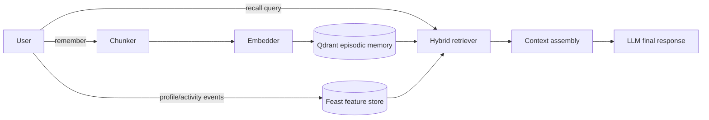

# Hybrid Memory POC

## Mục tiêu

POC này kết hợp ba loại ngữ cảnh cho trợ lý tiếng Việt: episodic memory là các đoạn hội thoại hoặc tài liệu đã đọc, stable profile là đặc điểm tương đối ít thay đổi, và recent activity là tín hiệu ngắn hạn. `HybridMemoryAgent` không gọi LLM thật; nó trả về context đã ghép để một LLM phía sau có thể dùng.

## Quyết định 1: chunking

Tôi chọn chia theo ranh giới câu, sau đó gộp đến khoảng 420 ký tự. Per-message giữ nguyên ngữ cảnh tốt nhưng một message dài sẽ làm context phình to; per-conversation giảm số vector nhưng truy vấn một chi tiết nhỏ dễ kéo theo nhiều nội dung nhiễu. Chunk quá ngắn tăng storage và mất đồng tham chiếu, còn chunk quá dài làm giảm độ chính xác và chiếm context window. Cách sentence-aware ở giữa giữ được ý tương đối hoàn chỉnh, giới hạn kích thước và cho phép top-3 memories đi vào prompt. POC chưa có semantic boundary model, nên các đoạn không có dấu câu vẫn được lưu thành một chunk.

## Quyết định 2: feature schema

Stable profile dùng feature dạng bảng: `preferred_language` (entity `user_id`, TTL 30 ngày, nguồn profile), `reading_speed_wpm` (cùng entity và TTL, nguồn telemetry), và `topic_affinity` (TTL 7 ngày, nguồn tổng hợp lịch sử). Recent activity dùng `queries_last_hour` (entity `user_id`, TTL 1 giờ, nguồn streaming) và nên được cập nhật bằng Push API thay vì batch. Tôi chọn scalar/tabular features thay cho embedding profile vì chúng dễ giải thích, dễ PIT join và dễ kiểm tra privacy. Embedding sở thích có thể bắt latent preference tốt hơn, nhưng khó debug và khó xóa một thuộc tính cá nhân cụ thể. Episodic embedding vẫn ở Qdrant vì chu kỳ index và truy vấn khác với feature serving.

## Quyết định 3: freshness

Không có một TTL phù hợp cho mọi use case. Khi người dùng vừa đọc tài liệu bảo mật, câu hỏi “tôi vừa quan tâm gì?” cần sub-second streaming để activity mới xuất hiện ngay. Với “recommend tài liệu tiếp theo”, refresh 5 phút là đủ vì ranking không cần thay đổi từng giây và batch rẻ hơn. Với stable language hoặc reading speed, daily refresh là hợp lý; cập nhật quá thường xuyên chỉ tạo noise. Tương ứng, POC giữ activity trong profile fallback ngay lập tức, còn production sẽ Push vào streaming feature view và materialize profile chậm hơn.

## Lựa chọn bị loại

Tôi đã cân nhắc lưu toàn bộ episodic embeddings như một embedding feature view trong Feast, nhưng chọn tách ra Qdrant. Vector store tối ưu ANN, metadata filter và RRF; feature store tối ưu point-in-time correctness và online lookup cho số feature nhỏ. Hai vòng đời cũng khác nhau: memory mới có thể đến mỗi phút, trong khi profile thường cập nhật theo giờ hoặc ngày. Trộn chúng làm khó re-index, TTL và xóa dữ liệu theo user.

## Vietnamese-context

Query có thể code-switch giữa tiếng Việt và thuật ngữ English như “cloud security”, nên payload và log phải giữ Unicode và tokenizer không được chỉ dựa vào danh sách từ tiếng Anh. Whitespace split là baseline dễ tái lập nhưng chưa xử lý tốt từ ghép tiếng Việt, dấu câu và typo theo âm. Production nên benchmark `underthesea` hoặc `pyvi` trên golden set; đánh đổi là thêm dependency, latency và khả năng token hóa sai tên sản phẩm. Có thể thêm normalization dấu, alias cho “k8s/Kubernetes”, và fuzzy fallback cho lỗi gõ. Profile cũng nên giới hạn theo `user_id`, mã hóa dữ liệu nhạy cảm và hỗ trợ xóa theo yêu cầu, vì memory cá nhân thuộc phạm vi dữ liệu cá nhân.

## Giới hạn hiện tại

POC chưa mã hóa at rest, chưa có CRUD/forgetting, chưa đồng bộ đa thiết bị và profile fallback là in-memory. Filter `user_id` là lớp cô lập chính trong demo nhưng production cần authorization ở service boundary, test isolation, audit log và key management. Feast adapter có thể được truyền vào agent sau khi NB4 đã `apply` và `materialize`; nếu chưa có, demo vẫn chạy bằng profile deterministic.
